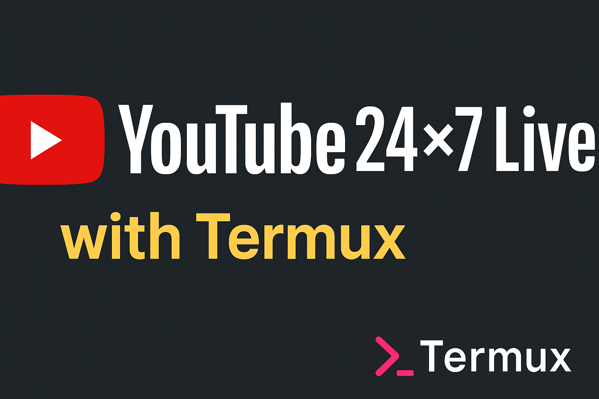

# 📺 ytlive-termux

A lightweight Termux-based script to stream **24×7 live video or audio** to **YouTube Live** using **FFmpeg**.



---

## ✨ Features
- 📺 Stream videos 24×7 to YouTube  
- 🎶 Stream audio with static image (radio style)  
- 🔑 Manage multiple stream profiles (keys & files)  
- 🔄 Auto-reconnect if stream fails  
- 🔋 Prevents phone from sleeping (termux-wake-lock)  
- 📱 100% Android + Termux (no PC required)  

---

## 🚀 Installation

```bash
pkg update && pkg upgrade -y
pkg install ffmpeg -y
pkg install git -y
pkg install termux-api -y

git clone https://github.com/yourusername/ytlive-termux.git
cd ytlive-termux
chmod +x ytlive.sh
```

---

## ▶️ Usage

Run the script:

```bash
./ytlive.sh
```

- On first run → it will ask for **YouTube Stream Key** and **Video/Audio Path**  
- Next runs → you can choose to **reuse old config** or **set new one**  

---

## 📖 Example

```bash
./ytlive.sh
```
➡ Select "Continue with old settings" → Stream starts instantly!  

---

## 🏷️ Tags
`termux` `youtube-live` `ffmpeg` `livestreaming` `rtmp` `automation` `android` `bash-script`

---

## 📜 License
MIT License – free to use and modify.
